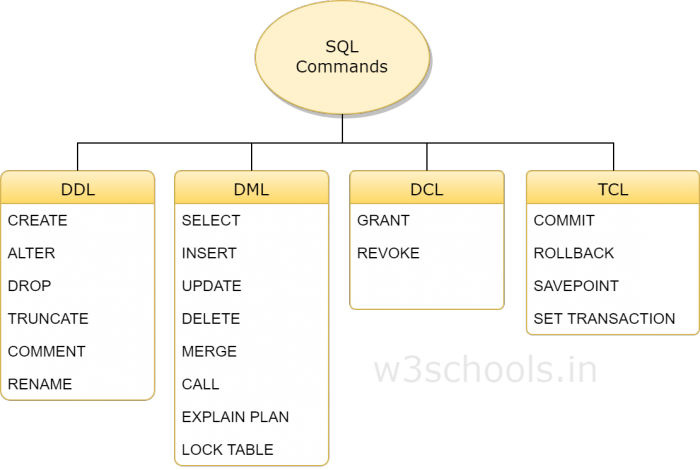

## DDL 

Data Definition Language ( DDL) são usadas para definir a estrutura de banco de dados ou esquema.

**CREATE**- para criar objetos no banco de dados
**ALTER** - altera a estrutura da base de dados
**TRUNCATE** - remover todos os registros de uma tabela, incluindo todos os espaços alocados para os registros são removidos
**COMMENT** - adicionar comentários ao dicionário de dados
**RENAME** - para renomear um objeto
**DROP** - para apagar tabelas ou database

## DML

Data Manipulation Language ( DML) são utilizados para o gerenciamento de dados dentro de objetos do banco.

**SELECT**- recuperar dados do banco de dados
**INSERT** – inserir dados em uma tabela
**UPDATE** – atualiza os dados existentes em uma tabela
**DELETE** – exclui registros de uma tabela,
**CALL** – chamar um subprograma PL / SQL
**EXPLAIN PLAN** – explicar o caminho de acesso aos dados
**LOCK TABLE** – controle de concorrência

## DCL 

Data Control Language ( DCL ) declarações.

**GRANT** – atribui privilégios de acesso do usuário a objetos do banco de dados
**REVOKE** – remove os privilégios de acesso aos objetos obtidos com o comando GRANT

##TCL
Transaction Control Language – (Controle de Transações) são usados ​​para gerenciar as mudanças feitas por instruções DML . Ele permite que as declarações a serem agrupadas em transações lógicas .

**COMMIT** – salvar o trabalho feito
**SAVEPOINT** – identificar um ponto em uma transação para que mais tarde você pode efetuar um ROLLBACK
**ROLLBACK** – restaurar banco de dados ao original desde o último COMMIT