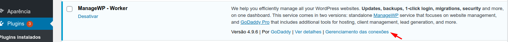
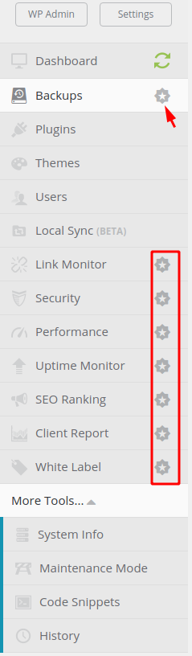

- Gerenciar outras instalações via site managewp.com
- Para cada instalação, instalar o plugin e gerar o codigo KEY 
  

  **Lista de Características**
  - Gerencia (site, plugins, usuarios )
  - Sincronização de um wordpress - para sua maquina local ou outro endereço que tenha esse plugin instalado
  - Code Snippets - Você pode criar codigos php para obter ou fazer algo em cada site

  **Lista de Características - Pagas **

  Apesar de serem pagas, tem opção limitada de uso gratuita

  - Backup
  - Link Monitor
  - Segurança
  - Performance
  - Uptime monitor
  - SEO Ranking
  - Client Report
  - White Label

Alternativas
  - Free/Premium - Open Source - https://mainwp.com/ - $20/m or $399 OTF
  - https://infinitewp.com/