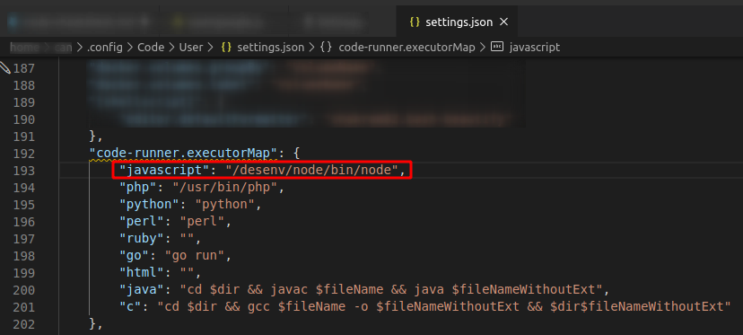
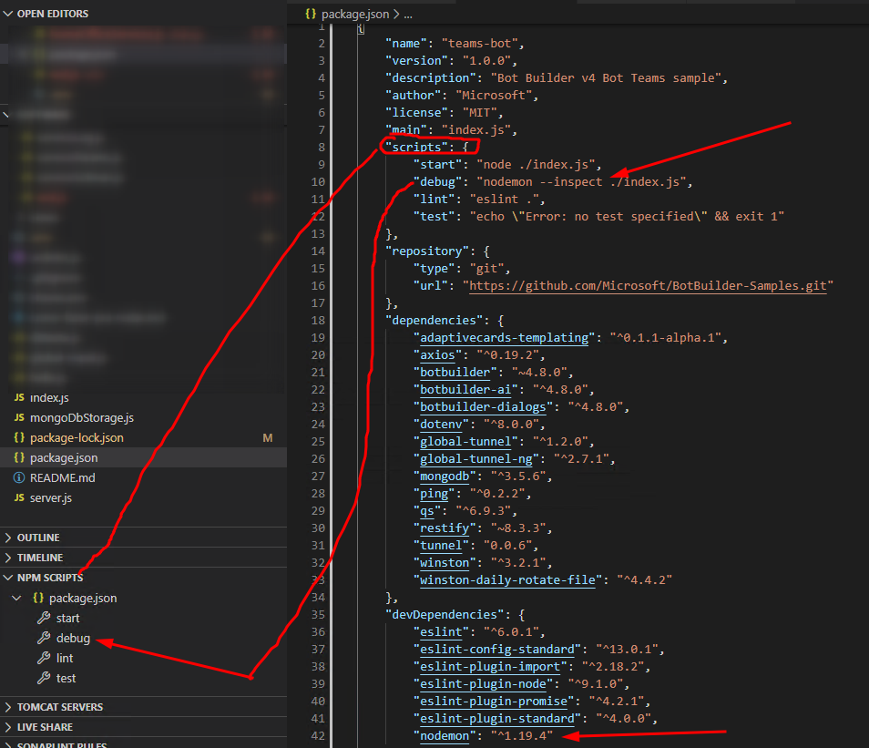

# Documentação
 - https://nodejs.org/api/documentation.html
   - Assertion Testing Async Hooks Buffer C++ Addons C/C++ Addons with N-API C++ Embedder API Child Processes Cluster Command Line Options Console Crypto Debugger Deprecated APIs DNS Domain ECMAScript Modules Errors Events File System Globals HTTP HTTP/2 HTTPS Inspector Internationalization Modules Net OS Path Performance Hooks Policies Process Punycode Query Strings Readline REPL Report Stream String Decoder Timers TLS/SSL Trace Events TTY UDP/Datagram URL Utilities V8 VM WASI Worker Threads Zlib

# Ferramentas
## Linha de Comando
`npm i -g mocha` - Testes


## VS CODE
- [aslamanver.node-js-dependency-manager](https://marketplace.visualstudio.com/items?itemName=aslamanver.node-js-dependency-manager)
- [formulahendry.code-runner](https://marketplace.visualstudio.com/items?itemName=formulahendry.code-runner) 
- [denisgolovin.dependencies-diagram-generator](https://marketplace.visualstudio.com/items?itemName=DenisGolovin.dependencies-diagram-generator)
- [AlexShen.classdiagram-ts](https://marketplace.visualstudio.com/items?itemName=AlexShen.classdiagram-ts)
- [wallabyjs.quokka-vscode](https://marketplace.visualstudio.com/items?itemName=WallabyJs.quokka-vscode) - Live Scratchpad for JavaScript.
  - CTRL K,Q no arquivo aberto para funcionar
  - Ctrl + K, J para JavaScript, ou Cmd/Ctrl + K, T para TypeScript
  - https://quokkajs.com/docs/
- [WallabyJs.wallaby-vscode](https://marketplace.visualstudio.com/items?itemName=WallabyJs.wallaby-vscode)
  - Semelhante ao quokka, US$500
- [pack.jade-bootstrap](https://marketplace.visualstudio.com/items?itemName=pack.jade-bootstrap) Snippets para Template Jade


- https://marketplace.visualstudio.com/items?itemName=howardzuo.vscode-npm-dependency

## Criar um projeto

`npm init`

## Gerar um EXE
- https://stackoverflow.com/questions/8173232/how-to-make-exe-files-from-a-node-js-app
  - npm install -g pkg
    - pkg exampleApp.js

## Scaffolding
- https://devblogs.microsoft.com/visualstudio/node-js-zero-to-bobble-with-visual-studio-code/
  - npm install express-generator -g 
```sh 
express myapp #gerar Express scaffolding
cd myapp #entra na pasta
npm install #instala as dependencias mencionadas no package.json
C:srcmyapp> code . #Inicia o VScode na pasta atual
```

## Node Utils
- https://www.npmjs.com/package/http-server Servidor HTTP
  - npm install --global http-server
- https://www.npmjs.com/package/exe Execute executaveis do sistema
  - npm i -S exe


## Debug
- VS Code
  - `npm i -g nodemon` - Debug
    - 

## Exemplos

execute na linha de comando `node`

e cole 
```js
const https = require('https');

console.log(https.get("https://google.com"));
```
ou salve o conteúdo e execute `node <nome-do-arquivo.js>`


## Primeiro Servidor Hello World

criar um arquivo hello-world.js e executar: `node hello-world.js`

```js
const http = require('http');

const hostname = '127.0.0.1';
const port = 3000;

const server = http.createServer((req, res) => {
  res.statusCode = 200;
  res.setHeader('Content-Type', 'text/plain');
  res.end('Hello, World!\n');
});

server.listen(port, hostname, () => {
  console.log(`Server running at http://${hostname}:${port}/`);
});
```

### Mysql

`npm install mysql` instalação local

```js

var mysql = require('mysql');

var con = mysql.createConnection({
  host: "localhost",
  user: "my_user",
  password: "my_password"
});

con.connect(function(err) {
  if (err) throw err;
  console.log("Connected!");

  con.query("SELECT * FROM mysql.user", function (err, result, fields) {
  if (err) throw err;
  console.log(result);
  });
});


```


## Audit
Busca por vulnerabilidades nas bibliotecas

- `npm audit` 
- `npm audit fix`

# Deveria Ver

## JS Referencias 

https://developer.mozilla.org/en-US/docs/Web/JavaScript/Reference

- Built-in objects
- Expressions & operators
- Statements & declarations
- Functions
- Classes
- Errors
- Misc
  
## Lib

- [Promise](https://developer.mozilla.org/en-US/docs/Web/JavaScript/Reference/Global_Objects/Promise)
- [Axios]()
  
## Tutoriais

- [w3schools.com](https://www.w3schools.com/nodejs/default.asp)

## Artigos

- [How to write a VS Code extension](https://opensource.com/article/20/6/vs-code-extension?utm_campaign=intrel)
- [Fast data modeling with JavaScript](https://opensource.com/article/20/5/data-modeling-javascript?utm_campaign=intrel)
- [Build an interactive CLI with Node.js](https://opensource.com/article/18/7/node-js-interactive-cli)