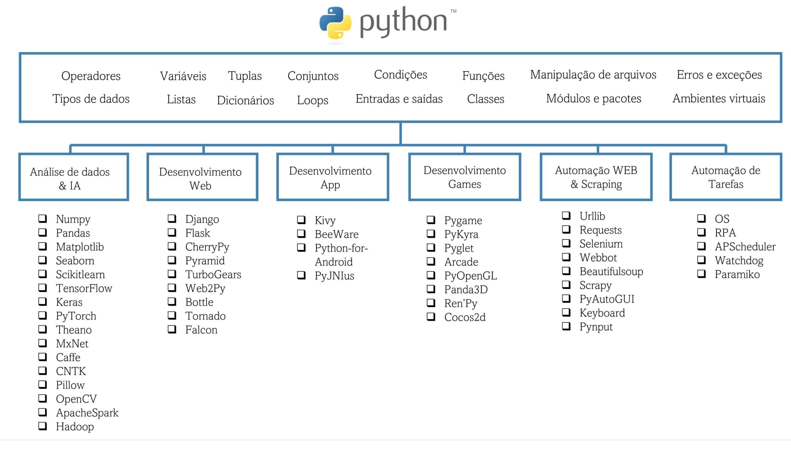

# VSCODE

## Observações

- configurar formatar codigo ao colar

## Complementos

- Jupyter - Janela interativa, tipo de debug - [https://youtu.be/ol_S9G0nCNE?si=U2N1j7Qp_MBSoDhZ&amp;t=571](https://youtu.be/ol_S9G0nCNE?si=U2N1j7Qp_MBSoDhZ&t=571)
- Autopep8 - Formatador de Codigo (configure formatar on save > setting > formater)
- ionutvmi.path-autocomplete - completar paths
- donjayamanne.python-environment-manager Gerenciador de ENV

# PIP

- freeze - Listar todas as bibliotecas do python
- pandas - ler CSV

# Desenvolvimento

## Criação de ENV

Use o virtualenv ou se for usar o `poetry shell`

```typescript
sudo apt install python3-virtualenv

# Ambiente de teste
virtualenv test-env
source test-env/bin/activate
pip install -r requirements

# Ambiente de Produção
virtualenv prod-env
source test-env/bin/activate
pip install -r requirements
```

# Dicas

## **EAFP**

**EAFP**, que significa "**Easier to Ask for Forgiveness than Permission**" (Mais Fácil Pedir Desculpas do que Permissão), é um padrão de programação comum em Python que enfatiza a captura de exceções em vez de verificar condições antes de executar uma ação.

Em termos simples, o padrão EAFP sugere que é melhor tentar fazer algo e lidar com qualquer problema que possa ocorrer (pedindo desculpas, ou seja, capturando exceções) do que verificar antecipadamente se tudo está certo para prosseguir.

Aqui está um exemplo em Python:

```python
# Exemplo de EAFP

# Tentamos acessar uma chave em um dicionário e lidamos com a exceção KeyError, se ocorrer
meu_dict = {'chave': 'valor'}

try:
    valor = meu_dict['chave_inexistente']
except KeyError:
    print("A chave não existe no dicionário")
```

Neste exemplo, em vez de verificar se a chave `'chave_inexistente'` existe antes de acessá-la no dicionário `meu_dict`, tentamos acessá-la diretamente e lidamos com a exceção `KeyError` caso ela não exista. Isso segue o princípio EAFP, focando na ação primeiro e lidando com problemas, se houver, posteriormente.

Outro Exemplo:

```python
# Exemplo de EAFP com arquivo

# Tentamos abrir um arquivo e lidamos com a exceção FileNotFoundError, se ocorrer
try:
    with open('arquivo_inexistente.txt', 'r') as arquivo:
        conteudo = arquivo.read()
except FileNotFoundError:
    print("O arquivo não foi encontrado")
```

Neste exemplo, tentamos abrir o arquivo `'arquivo_inexistente.txt'` para leitura dentro de um bloco `try-except`. Se o arquivo não existir, será lançada a exceção `FileNotFoundError`, e então podemos lidar com ela de forma adequada, neste caso, exibindo uma mensagem indicando que o arquivo não foi encontrado. Essa abordagem segue o padrão EAFP ao invés de verificar antecipadamente se o arquivo existe antes de tentar abri-lo.

## Supressão de Exceção (contextlib.suppress)

`contextlib.suppress(CustomError)` é uma ferramenta útil em Python para suprimir ou ignorar exceções específicas durante a execução de um bloco de código.

Aqui está como funciona:

1. **Importando a Biblioteca:** Primeiro, você precisa importar a biblioteca `contextlib`.
2. **Usando `suppress`:** Em seguida, você pode usar `contextlib.suppress()` passando o tipo de exceção que deseja suprimir como argumento. Por exemplo, `contextlib.suppress(FileNotFoundError)`.
3. **Utilizando em um Bloco de Código:** Você envolve o código que pode gerar a exceção dentro de um bloco `with contextlib.suppress()`.

Aqui está um exemplo usando `contextlib.suppress(CustomError)`:

```python
import contextlib

# Definindo uma exceção personalizada
class CustomError(Exception):
    pass

# Tentando levantar a exceção CustomError
try:
    raise CustomError("Ocorreu um erro personalizado")
except CustomError:
    print("Exceção CustomError capturada")

# Usando contextlib.suppress para ignorar a exceção CustomError
with contextlib.suppress(CustomError):
    raise CustomError("Ocorreu um erro personalizado, mas será suprimido")
```

Neste exemplo, a primeira parte levanta e captura a exceção `CustomError`, enquanto a segunda parte utiliza `contextlib.suppress(CustomError)` para suprimir a mesma exceção. Isso é útil quando você quer continuar a execução do código mesmo se uma exceção específica for levantada, sem interromper o fluxo normal do programa.

# Mapa

fonte: https://didatica.tech/wp-content/uploads/2022/07/mapa-do-python-areas-e-aplicacoes-scaled.jpg

# Referências

- [https://www.youtube.com/watch?v=ol_S9G0nCNE](https://www.youtube.com/watch?v=ol_S9G0nCNE)
  - Anaconda (versao do python)
  - VSCODE
    - Plugin
      - Python da MS
      - Jupyter
