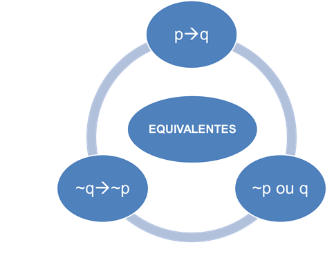

# Operadores
| Operador                | Descrição                                                                                                          |
| ----------------------- | ------------------------------------------------------------------------------------------------------------------ |
| ∼ (negação)             | A negação da proposição "A" é a proposição "~A", de maneira que se "A" é verdade então "~A" é falsa, e vice-versa. |
| ∧ (conjunção - E)       | A conjunção é verdadeira se e somente se os operandos são verdadeiros.                                             |
| ∨ (disjunção - OU)      | A disjunção é falsa se, e somente se ambos os operandos forem falsos.                                              |
| → (implicação)          | A conjunção é falsa se, e somente se, o primeiro operando é verdadeiro e o segundo operando é falso.               |
| ↔ (equivalência)        | A conjunção é verdadeira se, e somente se, ambos operandos forem falsos ou ambos verdadeiros (iguais).             |
| ⊻ (disjunção exclusiva) | A conjunção é verdadeira se, e somente se, apenas um dos operandos for verdadeiro                                  |
| ↓ (nor)                 | A conjunção é verdadeira se e somente se os operandos são falsos.                                                  |
| ↑ (nand)                | A disjunção é verdadeira se e somente se os operandos são falsos.                                                  |

# Tabela Verdade
| #  | A | B | C | D | ((A ∨ B → C) ∧ (C → D)) → (∼D → ∼A) |
| -- | - | - | - | - | ----------------------------------- |
| 1  | V | V | V | V | V                                   |
| 2  | V | V | V | F | V                                   |
| 3  | V | V | F | V | V                                   |
| 4  | V | F | V | V | V                                   |
| 5  | F | V | V | V | V                                   |
| 6  | F | F | F | V | V                                   |
| 7  | F | F | V | F | V                                   |
| 8  | F | V | F | F | V                                   |
| 9  | V | F | F | F | F                                   |
| 10 | F | F | F | F | V                                   |
| 11 | V | V | F | F | F                                   |
| 12 | F | F | V | V | V                                   |
| 13 | V | F | F | V | V                                   |
| 14 | F | V | V | F | V                                   |
| 15 | V | F | V | F | V                                   |
| 16 | F | V | F | V | V                                   |

Existe um macete para montar a tabela verdade: 2n sendo n=proposições (A,B,C,D,E...), no exemplo acima: 24=16 (linhas)

# Exemplos

## "Se p, então q" e "Se ~q, então ~p" são equivalentes

As duas proposições são equivalentes
- Se sou Curitibano, então sou paranaense
- Se **não** sou Curitibano, então **não** sou paranaense

## Ou para Se,Então

Vou cantar ou não me chamo Fulano
Se não cantar, então não me chamo Fulano

## Equivalência

p->q = ~p v q = ~q -> ~p

# Referências
- http://www.calculadoraonline.com.br/tabela-verdade