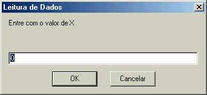

A Linguagem de Programação do VisuAlg (2)

**[]{#oparim}Operadores Aritméticos**

- +,- Operadores unários, isto é, são aplicados a um único operando. São os operadores aritméticos de maior precedência. Exemplos: -3, +x. Enquanto o operador unário - inverte o sinal do seu operando, o operador + não altera o valor em nada o seu valor. Operador de divisão inteira. Por exemplo, 5  2 = 2. Tem a mesma precedência do operador de divisão tradicional.

- +,-,\*,/ Operadores aritméticos tradicionais de adição, subtração, multiplicação e divisão. Por convenção, \* e / têm precedência sobre + e -. Para modificar a ordem de avaliação das operações, é necessário usar parênteses como em qualquer expressão aritmética.
- MOD ou %   Operador de módulo (isto é, resto da divisão inteira). Por exemplo, 8 MOD 3 = 2. Tem a mesma precedência do operador de divisão tradicional.
- ^ Operador de potenciação. Por exemplo, 5 ^ 2 = 25. Tem a maior precedência entre os operadores aritméticos binários (aqueles que têm dois operandos).

**Operadores de Caracteres**

- \+ Operador de concatenação de *strings* (isto é, cadeias de caracteres), quando usado com dois valores (variáveis ou constantes) do tipo "caractere". Por exemplo: "Rio " + " de Janeiro" = "Rio de Janeiro".
  
**Operadores Relacionais**

- =, <, >, <=, >=, <>    Respectivamente: igual, menor que, maior que, menor ou igual a, maior ou igual a, diferente de. São utilizados em expressões lógicas para se testar a relação entre dois valores do mesmo tipo. Exemplos: 3 = 3 ( 3 é igual a 3?) resulta em VERDADEIRO ; "A" > "B" ("A" está depois de "B" na ordem alfabética?) resulta em FALSO.

**Importante:** No VisuAlg, as comparações entre *strings* **não diferenciam** as letras maiúsculas das minúsculas. Assim, "ABC" é igual a "abc". Valores lógicos obedecem à seguinte ordem: FALSO < VERDADEIRO.

**[]{#oplog}Operadores Lógicos**

- **nao**   Operador unário de negação. nao VERDADEIRO = FALSO, e nao FALSO = VERDADEIRO. Tem a maior precedência entre os operadores lógicos. Equivale ao NOT do Pascal.
- **ou**    Operador que resulta VERDADEIRO quando um dos seus operandos lógicos for verdadeiro. Equivale ao OR do Pascal.
- **e**     Operador que resulta VERDADEIRO somente se seus dois operandos lógicos forem verdadeiros. Equivale ao AND do Pascal.
- **xou**   Operador que resulta VERDADEIRO se seus dois operandos lógicos forem diferentes, e FALSO se forem iguais. Equivale ao XOR do Pascal.
  
**Comandos de Saída de Dados**

[]{#escreva}escreva (<*lista-de-expressões>*)

Escreve no dispositivo de saída padrão (isto é, na área à direita da metade inferior da tela do VisuAlg) o conteúdo de cada uma das expressões que compõem *<lista-de-expressões>*.  As expressões dentro desta lista devem estar separadas por vírgulas; depois de serem avaliadas, seus resultados são impressos na ordem indicada. É equivalente ao comando *write* do Pascal.

De modo semelhante a Pascal, é possível especificar o número de espaços no qual se deseja escrever um determinado valor. Por exemplo, o comando escreva(x:5) escreve o valor da variável x em 5 espaços, alinhado-o à direita. Para variáveis reais, pode-se também especificar o número de casas fracionárias que serão exibidas. Por exemplo, considerando y como uma variável real, o comando escreva(y:6:2)escreve seu valor em 6 espaços colocando 2 casas decimais.

[]{#escreval}escreval (*<lista-de-expressões>*). 

Idem ao anterior, com a única diferença que pula uma linha em seguida. É equivalente ao *writeln* do Pascal.

Exemplos:

> algoritmo "exemplo"
> var x: real
>     y: inteiro
>     a: caractere
>     l: logico
> inicio
> x <- 2.5
> y <- 6
> a <- "teste"
> l <- VERDADEIRO
> escreval ("x", x:4:1, y+3:4) // Escreve: x 2.5    9
> escreval (a, "ok")           // Escreve: testeok (e depois pula
> linha)
> escreval (a, " ok")          // Escreve: teste ok (e depois pula
> linha)
> escreval (a + " ok")         // Escreve: teste ok (e depois pula
> linha)
> escreva (l)                  // Escreve: VERDADEIRO
> fimalgoritmo

Note que o VisuAlg separa expressões do tipo numérico e lógico com um espaço à esquerda, mas não as expressões do tipo caractere, para que assim possa haver a concatenação. Quando se deseja separar expressões do tipo caractere, é necessário acrescentar espaços nos locais adequados.

**Comando de Entrada de Dados**

[]{#leia}leia (*<lista-de-variáveis>*)

Recebe valores digitados pelos usuário, atribuindo-os às variáveis cujos nomes estão em *<lista-de-variáveis>* (é respeitada a ordem especificada nesta lista). É análogo ao comando *read* do Pascal.

Veja no exemplo abaixo o resultado:

algoritmo "exemplo 1"

var x: inteiro;
inicio
leia (x)
escreva (x)
fimalgoritmo

O comando de leitura acima irá exibir uma janela como a que se vê ao lado, com a mensagem padrão:

"Entre com o valor de *<nome-de-variável>"*

Se você clicar em *Cancelar* ou teclar *Esc* durante a leitura de dados, o programa será imediatamente interrompido.

**Comando de Desvio Condicional**

[]{#se}se *<expressão-lógica>* entao
    *<seqüência-de-comandos>*
fimse

Ao encontrar este comando, o VisuAlg analisa a *<expressão-lógica>*. Se o seu resultado for VERDADEIRO, todos os comandos da *<seqüência-de-comandos>* (entre esta linha e a linha com fimse) são executados. Se o resultado for FALSO, estes comandos são desprezados e a execução do algoritmo continua a partir da primeira linha depois do fimse.

se *<expressão-lógica>* entao
    *<seqüência-de-comandos-1>*
senao
    *<seqüência-de-comandos-2>*
fimse

Nesta outra forma do comando, se o resultado da avaliação de *<expressão-lógica>* for VERDADEIRO, todos os comandos da *<seqüência-de-comandos-1>* (entre esta linha e a linha com senao) são executados, e a execução continua depois a partir da primeira linha depois do fimse. Se o resultado for FALSO, estes comandos são desprezados e o algoritmo continua a ser executado a partir da primeira linha depois do senao, executando todos os comandos da *<seqüência-de-comandos-2>* (até a linha com fimse).

Estes comandos equivalem ao *if...then* e *if...then...else* do Pascal. Note que não há necessidade de delimitadores de bloco (como *begin* e *end*), pois as seqüências de comandos já estão delimitadas pelas palavras-chave senao e fimse. O VisuAlg permite o aninhamento desses comandos de desvio condicional.

**Comando de Seleção Múltipla**

O VisuAlg implementa (com certas variações) o comando *case* do Pascal.
A sintaxe é a seguinte:

[]{#escolha}escolha *<expressão-de-seleção>*
caso *<exp11>, <exp12>, ..., <exp1n>*
   *<seqüência-de-comandos-1>*
caso *<exp21>, <exp22>, ..., <exp2n>*
   *<seqüência-de-comandos-2>*
...
outrocaso
   *<seqüência-de-comandos-extra>*
fimescolha

Veja o exemplo a seguir, que ilustra bem o que faz este comando:

> algoritmo "Times"
> var time: caractere
> inicio
> escreva ("Entre com o nome de um time de futebol: ")
> leia (time)
> escolha time
> caso "Flamengo", "Fluminense", "Vasco", "Botafogo"
>    escreval ("É um time carioca.")
> caso "São Paulo", "Palmeiras", "Santos", "Corínthians"
>    escreval ("É um time paulista.")
> outrocaso
>    escreval ("É de outro estado.")
> fimescolha
> fimalgoritmo

[Anterior](linguagem.htm.md)
[Próxima](linguagem3.htm.md)
[Objetivos](objetivos.htm.md)
[Tela principal](telaprin.htm.md)
[Menu](menu.htm.md)
[A linguagem do VisuAlg](linguagem.htm.md)
[Referências da linguagem do VisuAlg](refer.htm.md)
[Mais recursos](autocomp.htm.md)