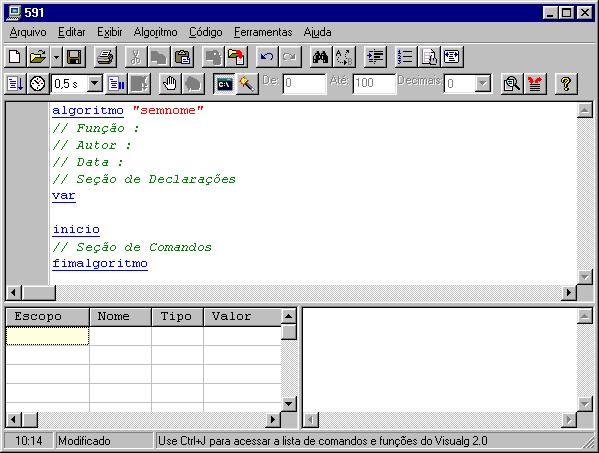
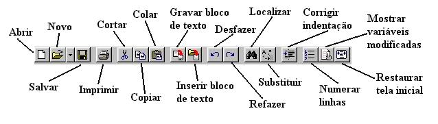
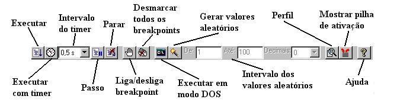

# A Tela Principal do VisuAlg 2

A tela do VisuAlg compõe-se da barra de tarefas, do editor de textos (que toma toda a sua metade superior), do quadro de variáveis (no lado esquerdo da metade inferior), do simulador de saída (no correspondente lado direito) e da barra de *status*. Quando o programa é carregado, já apresenta no editor um "esqueleto" de pseudocódigo, com a intenção de poupar trabalho ao usuário e de mostrar o formato básico que deve ser seguido. Explicaremos a seguir cada componente da interface do VisuAlg.

**A Barra de Tarefas**

Contém os comandos mais utilizados no VisuAlg (estes comandos também podem ser acessados pelo menu ou por atalhos no teclado).

**Abrir (Ctrl-A):** Abre um arquivo anteriormente gravado, substituindo o texto presente no editor. Se este tiver sido modificado, o VisuAlg pedirá sua confirmação para salvá-lo antes que seja sobreposto

**Novo (Ctrl-N):** Cria um novo "esqueleto" de pseudocódigo, substituindo o texto presente no editor. Se este tiver sido modificado, o VisuAlg pedirá sua confirmação para salvá-lo antes que seja sobreposto

**Salvar (Ctrl-S):** Grava imediatamente o texto presente no editor. Na primeira vez que um novo texto é gravado, o VisuAlg pede seu nome e localização

**Imprimir:** Imprime imediatamente na impressora padrão o texto presente no editor. Para configurar a impressão, use o comando Imprimir do menu Arquivo (acessível também pelo atalho *Ctrl-P*)

**Cortar (Ctrl-X):** Apaga texto selecionado, armazenando-o em uma área de transferência.
**Copiar (Ctrl-C):** Copia o texto selecionado para a área de transferência.
**Colar (Ctrl-V):** Copia texto da área de transferência para o local em que está o cursor.
**Gravar bloco de texto:** Permite a gravação em arquivo de um texto selecionado no editor. A extensão sugerida para o nome do arquivo é *.inc*.
**Inserir bloco de texto:** Permite a inserção do conteúdo de um arquivo. A extensão sugerida para o nome do arquivo é *.inc*.
**Desfazer (Ctrl-Z):** Desfaz último comando efetuado.
**Refazer (Shift-Ctrl-Z):** Refaz último comando desfeito.
**Localizar (Ctrl-L):** Localiza no texto presente no editor determinada palavra especificada.
**Substituir (Ctrl-U):** Localiza no texto presente no editor determinada palavra especificada, substituindo-a por outra.
**Corrigir Indentação (Ctrl-G)**: Corrige automaticamente a *indentação* (ou tabulação) do pseudocódigo, tabulando cada comando interno com espaços à esquerda

**Numerar linhas:** Ativa ou desativa a exibição dos números das linhas na área à esquerda do editor. A linha e a coluna do editor em que o cursor está em um determinado momento também são mostradas na barra de *status* (parte inferior da tela). Por motivos técnicos, esta opção é automaticamente desativada durante a execução do pseudocódigo, mas volta a ser ativada logo em seguida

**Mostrar variáveis modificadas**: Ativa ou desativa a exibição da variável que está sendo modificada. Como o número de variáveis pode ser grande, muitas podem estar fora da janela de visualização; quando esta característica está ativada, o VisuAlg rola a grade de exibição de modo que cada variável fique visível no momento em está sendo modificada. Este recurso é especialmente útil quando se executa um pseudocódigo passo a passo. Por questões de desempenho, a configuração padrão desta característica é *desativada,* quando o pseudocódigo está sendo executado automaticamente. No entanto, basta clicar este botão para executá-lo automaticamente com a exibição ativada. No final da execução, a configuração volta a ser *desativada*

**Restaurar tela inicial:**

**Executar (F9):** Inicia (ou continua) a execução automática do pseudocódigo

**Executar com *timer* (Shift-F9):**: Insere um atraso (que pode ser especificado no intervalo ao lado) antes da execução de cada linha. Também realça em fundo azul o comando que está sendo executado, da mesma forma que na execução passo a passo

**Intervalo do *timer*:** Atraso em cada linha, para quando se deseja executar o pseudocódigo com *timer*.
**Passo (F8):** Inicia (ou continua) a execução linha por linha do pseudocódigo, dando ao usuário a oportunidade de acompanhar o fluxo de execução, os valores das variáveis e a pilha de ativação dos subprogramas

**Parar (Ctrl-F2):** Termina imediatamente a execução do pseudocódigo. Evidentemente, este botão fica desabilitado quando o pseudocódigo não está sendo executado

**Liga/desliga *breakpoint* (F5):** Insere/remove um ponto de parada na linha em que esteja o cursor. Estes pontos de parada são úteis para a depuração e acompanhamento da execução dos pseudocódigos, pois permitem a verificação dos valores das variáveis e da pilha de ativação de subprogramas.
**Desmarcar todos os *breakpoints* (Ctrl-F5):** Desativa todos os *breakpoints* que estejam ativados naquele momento.
**Executar em modo DOS:** Com esta opção ativada, tanto a entrada como a saída-padrão passa a ser uma janela que imita o DOS, simulando a execução de um programa neste ambiente.
**Gerar valores aleatórios:** Ativa a geração de valores aleatórios que substituem a digitação de dados. A faixa padrão de valores gerados é de 0 a 100 inclusive, mas pode ser modificada (basta alterar intervalo ao lado). Para a geração de dados do tipo caractere, não há uma faixa pré-estabelecida: os dados gerados serão sempre *strings* de 5 letras maiúsculas.
**Intervalo dos valores aleatórios:** Faixa de valores que serão gerados automaticamente, quando esta opção estiver ativada

**Perfil (F7):** Após a execução de um pseudocódigo, exibe o número de vezes que cada umas das suas linhas foi executada. É útil para a análise de eficiência (por exemplo, nos métodos de ordenação)

**Mostrar pilha de ativação (Ctrl-F3):** Exibe a pilha de subprogramas ativados num dado momento. Convém utilizar este comando em conjunto com *breakpoints* ou com a execução passo a passo.
**Ajuda (F1):** Possibilita acesso às páginas de ajuda e às informações sobre o VisuAlg

**Quadro de Variáveis**

É formado por uma grade na qual são mostrados o escopo de cada variável (se for do programa principal, será global; se for local, será apresentado o nome do subprograma onde foi declarada), seus nomes (também com os índices, nos casos em que sejam vetores), seu tipo ("I" para inteiro, "R" para real, "C" para caractere e "L" para lógico) e o seu valor corrente. A versão atual do VisuAlg permite a visualização de até 500 variáveis (contando individualmente cada elemento dos vetores).

**A Barra de *Status***

Situada na parte inferior da tela, esta barra contém dois painéis: o primeiro mostra a linha e a coluna onde o cursor está, e o segundo mostra a palavra *Modificado* no caso em que o pseudocódigo tenha sido alterado desde que foi carregado ou salvo pela última vez. Nesta barra, há ainda um terceiro painel disponível, que ainda não tem um uso específico na atual versão.

[Objetivos](objetivos.htm.md)
[Tela principal](telaprin.htm.md)
[Menu](menu.htm.md)
[A linguagem do VisuAlg](linguagem.htm.md)
[Referências da linguagem do VisuAlg](refer.htm.md)
[Mais recursos](autocomp.htm.md)
