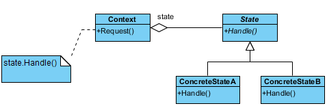
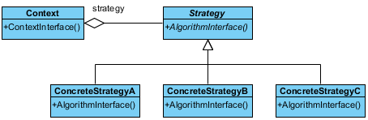
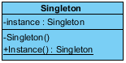

# GoF - Padrão de Design - Exemplos

Um padrão de design é uma solução geral e reutilizável para um problema de software comum. São modelos que podem ser reutilizados e personalizados para resolver um problema de design específico em muitas situações diferentes.

## Catálogo

Padrões de design são soluções para reutilização de software para desenvolvimento de software no mundo real. Um padrão é o esboço de uma solução reutilizável para um problema geral encontrado em um contexto específico. Estudar padrões é uma maneira eficaz de aprender com a experiência de outras pessoas. Eles contêm uma solução que foi comprovada para resolver efetivamente o problema no contexto indicado. Os 23 padrões do Gang of Four (GoF) são geralmente considerados a base para todos os outros padrões de design. Eles são categorizados em três grupos: Criador, Estrutural e Comportamental.

- Padrões de criação :  usados ​​para construir objetos de modo que possam ser dissociados do sistema de implementação.
- Padrões estruturais :  Usado para formar grandes estruturas de objetos entre muitos objetos diferentes.
- Padrões comportamentais :  usados ​​para gerenciar algoritmos, relacionamentos e responsabilidades entre objetos.

## Visitor

Este é um exemplo de diagrama de classes para o padrão Visitor.

**Objetivo**

Permite que uma ou mais operações sejam aplicadas a um conjunto de objetos em tempo de execução, dissociando as operações da estrutura de objetos.

**Quando usar**

Uma estrutura de objeto deve ter muitas operações não relacionadas executadas nela.
A estrutura do objeto não pode ser alterada, mas as operações executadas nela podem.
As operações devem ser executadas nas classes concretas de uma estrutura de objetos.
Expor estado interno ou operações da estrutura do objeto é aceitável.
As operações devem poder operar em várias estruturas de objetos que implementam os mesmos conjuntos de interfaces.

## Template Method

Este é um exemplo de diagrama de classe UML para o padrão do método de modelo.

**Objetivo**

Identifica a estrutura de um algoritmo, permitindo implementar classes para definir o comportamento real.

**Quando usar**

É necessária uma única implementação abstrata de um algoritmo.
O comportamento comum entre subclasses deve ser localizado em uma classe comum.
As classes pai devem poder invocar uniformemente o comportamento em suas subclasses.
A maioria ou todas as subclasses precisam implementar o comportamento.

## State

Este é um diagrama de classes para o padrão de design do estado

**Objetivo**

Vincula as circunstâncias do objeto ao seu comportamento, permitindo que o objeto se comporte de maneiras diferentes com base em seu estado interno.

**Quando usar**

O comportamento de um objeto deve ser influenciado por seu estado.
Condições complexas vinculam o comportamento do objeto ao seu estado.
As transições entre estados precisam ser explícitas.

## Strategy (Estratégia)

Este é um diagrama de classes para o padrão de design estratégico.

**Objetivo**

Define um conjunto de algoritmos encapsulados que podem ser trocados para executar um comportamento específico.

**Quando usar**

A única diferença entre muitas classes relacionadas é o seu comportamento.
São necessárias várias versões ou variações de um algoritmo.
Os algoritmos acessam ou utilizam dados aos quais o código de chamada não deve ser exposto.
O comportamento de uma classe deve ser definido em tempo de execução.
Declarações condicionais são complexas e difíceis de manter.

## Observer (Observador)

Este é um diagrama de classes UML para o padrão de design do observador.

**Objetivo**

Permite que um ou mais objetos sejam notificados sobre alterações de estado em outros objetos no sistema.

**Quando usar**

Alterações de estado em um ou mais objetos devem desencadear comportamento em outros objetos
Recursos de transmissão são necessários.
Existe um entendimento de que os objetos ficarão cegos às custas da notificação.

## Memento (Lembrança)

Este é um exemplo de diagrama de classe UML para o padrão de design do Mememo.

**Objetivo**

Permite capturar e externalizar o estado interno de um objeto para que possa ser restaurado mais tarde, tudo sem violar o encapsulamento.

**Quando usar**

O estado interno de um objeto deve ser salvo e restaurado posteriormente.
O estado interno não pode ser exposto por interfaces sem expor a implementação.
Os limites do encapsulamento devem ser preservados.

## Mediator (Mediador)

Este é um exemplo de diagrama de classes para o padrão de design do Mediador.

**Objetivo**

Permite acoplamentos soltos, encapsulando a maneira como conjuntos diferentes de objetos interagem e se comunicam. Permite que as ações de cada objeto definido variem independentemente uma da outra.

**Quando usar**

A comunicação entre conjuntos de objetos é bem definida e complexa.
Existem muitos relacionamentos e é necessário um ponto comum de controle ou comunicação.

## Iterator (Iterador)

Este é um exemplo de diagrama de classes para o padrão de design do Iterator.

**Objetivo**

Permite o acesso aos elementos de um objeto agregado sem permitir o acesso à sua representação subjacente.

**Quando usar**

O acesso aos elementos é necessário sem acesso a toda a representação.
São necessários percursos múltiplos ou simultâneos dos elementos.
É necessária uma interface uniforme para a travessia.
Existem diferenças sutis entre os detalhes de implementação de vários iteradores.

## Interpreter (Intérprete)

Este é um exemplo de diagrama de classes para o padrão de design do Interpreter.

**Objetivo**

Define uma representação para uma gramática, bem como um mecanismo para entender e agir de acordo com a gramática.

**Quando usar**

Existe uma gramática para interpretar que pode ser representada como grandes árvores de sintaxe.
A gramática é simples.
Eficiência não é importante.
A dissociação da gramática das expressões subjacentes é desejada.

## Chain of Responsability (Cadeia de Responsabilidade)

Este é um exemplo de diagrama de classe UML para o padrão de design da Cadeia de Responsabilidade.

**Objetivo**

Dá a mais de um objeto a oportunidade de manipular uma solicitação, vinculando objetos de recebimento.

**Quando usar**

Vários objetos podem manipular uma solicitação e o manipulador não precisa ser um objeto específico.
Um conjunto de objetos deve poder manipular uma solicitação com o manipulador determinado em tempo de execução.
Uma solicitação que não está sendo tratada é um resultado potencial aceitável. 

## Proxy 

Este é um exemplo de diagrama de classe UML para o padrão de design do Proxy.

**Objetivo**

Permite o controle de acesso no nível do objeto, agindo como uma entidade de passagem ou um objeto de espaço reservado.

**Quando usar**

O objeto que está sendo representado é externo ao sistema.
Os objetos precisam ser criados sob demanda.
O controle de acesso para o objeto original é necessário.
A funcionalidade adicionada é necessária quando um objeto é acessado.

## Command (Comando)

Este é um exemplo de diagrama de classe UML para o padrão de design do Comando.

**Objetivo**

Encapsula uma solicitação, permitindo que ela seja tratada como um objeto. Isso permite que a solicitação seja tratada em relacionamentos tradicionalmente baseados em objetos, como filas e retornos de chamada.

**Quando usar**

Você precisa da funcionalidade de retorno de chamada.
As solicitações precisam ser tratadas em horários de variante ou em pedidos de variante.
É necessário um histórico de solicitações.
O invocador deve ser dissociado do objeto que manipula a invocação.

## Facade (Fachada)

Este é um diagrama de classes UML para o padrão de design do Facade.

**Objetivo**

Fornece uma única interface para um conjunto de interfaces dentro de um sistema.

**Quando usar**

É necessária uma interface simples para fornecer acesso a um sistema complexo.
Existem muitas dependências entre implementações de sistema e clientes.
Sistemas e subsistemas devem ser em camadas.

## Flyweight

Este é um exemplo de diagrama de classe UML para o padrão de design do Flyweight.

**Objetivo**

Facilita a reutilização de muitos objetos refinados, tornando mais eficiente a utilização de um grande número de objetos.

**Quando usar**

Muitos objetos semelhantes são usados ​​e o custo de armazenamento é alto.
A maioria do estado de cada objeto pode ser extrínseca.
Alguns objetos compartilhados podem substituir muitos objetos não compartilhados.
A identidade de cada objeto não importa.

## Bridge (Ponte)

Este é um exemplo de diagrama de classe UML para o padrão de design do Bridge.

**Objetivo**

Define uma estrutura de objeto abstrata independentemente da estrutura de objeto de implementação para limitar o acoplamento.

**Quando usar**

Abstrações e implementações não devem ser vinculadas em tempo de compilação.
Abstrações e implementações devem ser independentemente extensíveis.
Alterações na implementação de uma abstração não devem ter impacto nos clientes.
Os detalhes da implementação devem estar ocultos do cliente.

## Decorator (Decorador)

Este é um exemplo de diagrama de classe UML para o padrão de design do Decorator.

**Objetivo**

Permite o empacotamento dinâmico de objetos para modificar suas responsabilidades e comportamentos existentes.

**Quando usar**

As responsabilidades e comportamentos dos objetos devem ser dinamicamente modificáveis.
Implementações concretas devem ser dissociadas de responsabilidades e comportamentos.
A subclassificação para obter modificações é impraticável ou impossível.
Funcionalidades específicas não devem residir alto na hierarquia de objetos.
Muitos pequenos objetos em torno de uma implementação concreta são aceitáveis.

## Composite (Composto)

Este é um exemplo de diagrama de classes para o padrão de design Composto.

**Objetivo**

Facilita a criação de hierarquias de objetos em que cada objeto pode ser tratado independentemente ou como um conjunto de objetos aninhados através da mesma interface.

**Quando usar**

Representações hierárquicas de objetos são necessárias.
Objetos e composições de objetos devem ser tratados de maneira uniforme.

## Adapter (Adaptador)

Este é um exemplo de diagrama de classe UML para o padrão de design do Adaptador.

**Objetivo**

Permite que classes com interfaces diferentes trabalhem juntas, criando um objeto comum pelo qual elas podem se comunicar e interagir.

**Quando usar**

Uma classe a ser usada não atende aos requisitos de interface.
Condições complexas vinculam o comportamento do objeto ao seu estado.
As transições entre estados precisam ser explícitas.

## Singleton

Este é um exemplo de diagrama de classe UML para o padrão de design do Singleton.

**Objetivo**

Garante que apenas uma instância de uma classe seja permitida dentro de um sistema.

**Quando usar**

Exatamente uma instância de uma classe é necessária.
O acesso controlado a um único objeto é necessário.
Exemplo

A maioria dos idiomas fornece algum tipo de objeto de sistema ou ambiente que permite que o idioma interaja com o sistema operacional nativo. Como o aplicativo está fisicamente sendo executado em apenas um sistema operacional, existe apenas a necessidade de uma única instância desse objeto do sistema. O padrão singleton seria implementado pelo tempo de execução do idioma para garantir que apenas uma única cópia do objeto do sistema seja criada e para garantir que apenas processos adequados tenham acesso permitido a ele.

## Builder (Construtor)

Este é um exemplo de diagrama de classe UML para o padrão de design do construtor.

**Objetivo**

Permite a criação dinâmica de objetos com base em algoritmos facilmente intercambiáveis.

**Quando usar**

Os algoritmos de criação de objetos devem ser dissociados do sistema.
Várias representações de algoritmos de criação são necessárias.
A adição da nova funcionalidade de criação sem alterar o código principal é necessária.
O controle de tempo de execução sobre o processo de criação é necessário.

## Prototype (Protótipo)

Este é um exemplo de diagrama de classe UML para o padrão de design do protótipo.

**Objetivo**

Crie objetos com base em um modelo de objetos existentes por meio da clonagem.

**Quando usar**

Composição, criação e representação de objetos devem ser dissociadas de um sistema.
As classes a serem criadas são especificadas em tempo de execução.
Um número limitado de combinações de estados existe em um objeto.
São necessários objetos ou estruturas de objetos idênticos ou semelhantes a outros objetos ou estruturas de objetos existentes.
A criação inicial de cada objeto é uma operação cara.

## Factory Method (Método Fábrica)

Este é um diagrama de classes UML para o padrão de design do método de fábrica.

**Objetivo**

Expõe um método para criar objetos, permitindo que as subclasses controlem o processo de criação real.

**Quando usar**

Uma classe não saberá quais classes serão necessárias para criar.
As subclasses podem especificar quais objetos devem ser criados.
As classes pai desejam adiar a criação para suas subclasses.

## Abstract Factory (Fábrica Abstrato)

Este é um exemplo de diagrama de classe UML para o padrão de design de fábrica abstrato.

**Objetivo**

Forneça uma interface que delegue chamadas de criação para uma ou mais classes concretas para entregar objetos específicos.

**Quando usar**

A criação de objetos deve ser independente do sistema que os utiliza.
Os sistemas devem ser capazes de usar várias famílias de objetos.
Famílias de objetos devem ser usadas juntas.
As bibliotecas devem ser publicadas sem expor os detalhes da implementação.
As classes concretas devem ser dissociadas dos clientes.

# Referências

- https://circle.visual-paradigm.com/category/gof-design/
