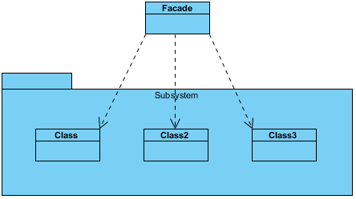
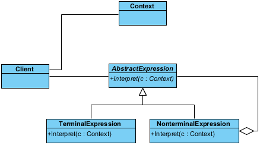

# GoF - Padrão de Design - Exemplos

Um padrão de design é uma solução geral e reutilizável para um problema de software comum. São modelos que podem ser reutilizados e personalizados para resolver um problema de design específico em muitas situações diferentes.

## Catálogo

Padrões de design são soluções para reutilização de software para desenvolvimento de software no mundo real. Um padrão é o esboço de uma solução reutilizável para um problema geral encontrado em um contexto específico. Estudar padrões é uma maneira eficaz de aprender com a experiência de outras pessoas. Eles contêm uma solução que foi comprovada para resolver efetivamente o problema no contexto indicado. Os 23 padrões do Gang of Four (GoF) são geralmente considerados a base para todos os outros padrões de design. Eles são categorizados em três grupos: Criador, Estrutural e Comportamental.

- Padrões de criação :  usados ​​para construir objetos de modo que possam ser dissociados do sistema de implementação.
- Padrões estruturais :  Usado para formar grandes estruturas de objetos entre muitos objetos diferentes.
- Padrões comportamentais :  usados ​​para gerenciar algoritmos, relacionamentos e responsabilidades entre objetos.

## Padrões de criação

 - Às vezes, os padrões criacionais são concorrentes: há casos em que o Prototype ou o Abstract Factory poderiam  - ser usados ​​com lucro. Outras vezes, são complementares: o Abstract Factory pode armazenar um conjunto de  - protótipos dos quais clonar e retornar objetos do produto [GOF, p126], o Builder pode usar um dos outros  - padrões para implementar quais componentes são construídos. Abstract Factory , Builder e Prototype podem usar  - Singleton em sua implementação. [GOF, pp81.134]
 - Resumo Factory , Builder e Prototype definem um objeto de fábrica que é responsável por conhecer e criar a  - classe de objetos de produto e o tornam um parâmetro do sistema. Abstract Factory possui o objeto factory  - produzindo objetos de várias classes. O Builder possui o objeto de fábrica que constrói um produto complexo  - de forma incremental usando um protocolo correspondentemente complexo. O protótipo possui o objeto de fábrica  - (também conhecido como protótipo) que cria um produto copiando um objeto de protótipo. [GOF, pág. 135]
 - Resumo As classes Factory geralmente são implementadas com o Factory Method s, mas também podem ser  - implementadas usando Prototype . [GOF, p95]
 - Abstract Factory pode ser usado como uma alternativa ao Facade para ocultar classes específicas da  - plataforma. [GOF, pág. 193]
 - O Builder se concentra na construção passo a passo de um objeto complexo. Resumo O Factory enfatiza uma  - família de objetos do produto (simples ou complexos). O Builder retorna o produto como uma etapa final, mas,  - no que diz respeito à Abstract Factory , o produto é retornado imediatamente. [GOF, pág. 105]
 - O construtor é a criação, assim como a estratégia é o algoritmo. [Ícone, p8-13]
 - O construtor geralmente cria um composto . [GOF, pág. 106]
 - Os métodos de fábrica são geralmente chamados nos métodos de modelo . [GOF, p116]
 - Método de Fábrica : criação por herança. Protótipo : criação por delegação.
 - Freqüentemente, os projetos começam com o Factory Method (subclasses menos complicadas, mais personalizáveis  - ​​e proliferam) e evoluem para Abstract Factory , Prototype ou Builder (mais flexível, mais complexo) à  - medida que o designer descobre onde é necessária mais flexibilidade. [GOF, pág. 136]
 - O protótipo não requer subclassificação, mas requer uma operação Initialize. O Método de Fábrica requer  - subclassificação, mas não requer Inicialização. [GOF, p116]
 - Projetos que fazem uso pesado dos padrões Composite e Decorator também podem se beneficiar do Prototype . [GOF, pág. 126]

### Builder (Construtor)

Este é um exemplo de diagrama de classe UML para o padrão de design do construtor.

**Objetivo**

- Permite a criação dinâmica de objetos com base em algoritmos facilmente intercambiáveis.
- Separe a construção de um objeto complexo da sua representação para que o mesmo processo de construção possa criar representações diferentes.
- Analisar uma representação complexa, criar um dos vários destinos

**Quando usar**

- Os algoritmos de criação de objetos devem ser dissociados do sistema.
- Várias representações de algoritmos de criação são necessárias.
- A adição da nova funcionalidade de criação sem alterar o código principal é necessária.
- O controle de tempo de execução sobre o processo de criação é necessário.

### Singleton

Este é um exemplo de diagrama de classe UML para o padrão de design do Singleton.

**Objetivo**

- Garante que apenas uma instância de uma classe seja permitida dentro de um sistema.
- Aplicação de instância única, inicialização lenta, acesso global

**Quando usar**

- Exatamente uma instância de uma classe é necessária.
- O acesso controlado a um único objeto é necessário.
Exemplo

A maioria dos idiomas fornece algum tipo de objeto de sistema ou ambiente que permite que o idioma interaja com o sistema operacional nativo. Como o aplicativo está fisicamente sendo executado em apenas um sistema operacional, existe apenas a necessidade de uma única instância desse objeto do sistema. O padrão singleton seria implementado pelo tempo de execução do idioma para garantir que apenas uma única cópia do objeto do sistema seja criada e para garantir que apenas processos adequados tenham acesso permitido a ele.

### Prototype (Protótipo)

Este é um exemplo de diagrama de classe UML para o padrão de design do protótipo.

**Objetivo**

- Crie objetos com base em um modelo de objetos existentes por meio da clonagem.
- Criação dinâmica (dissociada) por meio de delegação

**Quando usar**

- Composição, criação e representação de objetos devem ser dissociadas de um sistema.
- As classes a serem criadas são especificadas em tempo de execução.
- Um número limitado de combinações de estados existe em um objeto.
- São necessários objetos ou estruturas de objetos idênticos ou semelhantes a outros objetos ou estruturas de objetos existentes.
- A criação inicial de cada objeto é uma operação cara.

### Factory Method (Método Fábrica)

Este é um diagrama de classes UML para o padrão de design do método de fábrica.

**Objetivo**

- Expõe um método para criar objetos, permitindo que as subclasses controlem o processo de criação real.
- Criação dinâmica (dissociada) por herança

**Quando usar**

- Uma classe não saberá quais classes serão necessárias para criar.
- As subclasses podem especificar quais objetos devem ser criados.
- As classes pai desejam adiar a criação para suas subclasses.

### Abstract Factory (Fábrica Abstrato)

Este é um exemplo de diagrama de classe UML para o padrão de design de fábrica abstrato.

**Objetivo**

- Forneça uma interface que delegue chamadas de criação para uma ou mais classes concretas para entregar objetos específicos.
- Muitas "plataformas", uma interface para criar uma família de produtos

**Quando usar**

- A criação de objetos deve ser independente do sistema que os utiliza.
- Os sistemas devem ser capazes de usar várias famílias de objetos.
- Famílias de objetos devem ser usadas juntas.
- As bibliotecas devem ser publicadas sem expor os detalhes da implementação.
- As classes concretas devem ser dissociadas dos clientes.

## Padrões Estruturais

- O adaptador faz as coisas funcionarem após serem projetadas; Bridge os faz trabalhar antes deles. [GOF, p219]
- O Bridge é projetado antecipadamente para permitir que a abstração e a implementação variem - independentemente. O adaptador é adaptado para fazer com que classes não relacionadas funcionem juntas. [GOF, - p161]
- O adaptador fornece uma interface diferente para o assunto. O proxy fornece a mesma interface. O Decorator - fornece uma interface aprimorada. [GOF, p216]
- O adaptador altera a interface de um objeto, o Decorator aprimora as responsabilidades de um objeto. O - decorador é, portanto, mais transparente para o cliente. Como conseqüência, o Decorator suporta composição - recursiva, o que não é possível com adaptadores puros . [GOF, pág. 149]
- Composite e Decorator têm diagramas de estrutura semelhantes, refletindo o fato de que ambos dependem de - composição recursiva para organizar um número ilimitado de objetos. [GOF, p219]
- O composto pode ser atravessado com o Iterator . O visitante pode aplicar uma operação sobre um composto . O - Composite pode usar a Cadeia de responsabilidade para permitir que os componentes acessem propriedades - globais por meio de seus pais. Também poderia usar o Decorator para substituir essas propriedades em partes - da composição. Ele poderia usar o Observer para vincular uma estrutura de objeto a outra e o State para - permitir que um componente alterasse seu comportamento à medida que seu estado fosse alterado. [GOF, pp.
- Composto pode permitir que você componha um mediador a partir de pedaços menores por meio de composição - recursiva. [Vlissides, 96 de abril, p. 18]
- O Decorator permite alterar a capa de um objeto. A estratégia permite que você mude a coragem. [GOF, pág. 184]
- O Decorator foi projetado para permitir adicionar responsabilidades aos objetos sem subclassificar. O foco do - Composite não está no embelezamento, mas na representação. Essas intenções são distintas, mas complementares. - Consequentemente, Composite e Decorator são frequentemente usados ​​em conjunto. [GOF, p220]
- O Decorator e o Proxy têm finalidades diferentes, mas estruturas semelhantes. Ambos descrevem como fornecer - um nível de indireção para outro objeto, e as implementações mantêm uma referência ao objeto para o qual - encaminham solicitações. [GOF, p220]
- O Facade define uma nova interface, enquanto o Adapter reutiliza uma interface antiga. Lembre-se de que o - Adapter faz com que duas interfaces existentes funcionem juntas, em vez de definir uma totalmente nova. [GOF, - p219]
- Os objetos de fachada geralmente são Singletons, porque apenas um objeto de fachada é necessário. [GOF, pág. - 193]
- O mediador é semelhante ao Facade , pois abstrai a funcionalidade das classes existentes. O mediador abstrai - / centraliza a comunicação arbitrária entre os objetos do colega, rotineiramente "agrega valor" e é conhecido - / referenciado pelos objetos do colega. Por outro lado, o Facade define uma interface mais simples para um - subsistema, não adiciona novas funcionalidades e não é conhecido pelas classes do subsistema. [GOF, pág. 193]
- Abstract Factory pode ser usado como uma alternativa ao Facade para ocultar classes específicas da - plataforma. [GOF, pág. 193]
- Enquanto o Flyweight mostra como criar muitos objetos pequenos, o Facade mostra como criar um único objeto - para representar um subsistema inteiro. [GOF, pág. 138]
- O Flyweight geralmente é combinado com o Composite para implementar nós de folhas compartilhados. [GOF, p206]
- O Flyweight explica quando e como os objetos State podem ser compartilhados. [GOF, p313]

### Adapter (Adaptador)

Este é um exemplo de diagrama de classe UML para o padrão de design do Adaptador.

**Objetivo**

- Permite que classes com interfaces diferentes trabalhem juntas, criando um objeto comum pelo qual elas podem se comunicar e interagir.
- Por impedância - corresponda um componente herdado a um novo sistema

**Quando usar**

- Uma classe a ser usada não atende aos requisitos de interface.
- Condições complexas vinculam o comportamento do objeto ao seu estado.
- As transições entre estados precisam ser explícitas.

### Bridge (Ponte)

Este é um exemplo de diagrama de classe UML para o padrão de design do Bridge.

**Objetivo**

- Define uma estrutura de objeto abstrata independentemente da estrutura de objeto de implementação para limitar o acoplamento.
- Dissociar a interface da implementação; ir além do encapsulamento para isolar

**Quando usar**

- Abstrações e implementações não devem ser vinculadas em tempo de compilação.
- Abstrações e implementações devem ser independentemente extensíveis.
- Alterações na implementação de uma abstração não devem ter impacto nos clientes.
- Os detalhes da implementação devem estar ocultos do cliente.

### Composite (Composto)

Este é um exemplo de diagrama de classes para o padrão de design Composto.

**Objetivo**

- Facilita a criação de hierarquias de objetos em que cada objeto pode ser tratado independentemente ou como um conjunto de objetos aninhados através da mesma interface.
- Composição recursiva acoplando a classe agregada a uma abstração comum

**Quando usar**

- Representações hierárquicas de objetos são necessárias.
- Objetos e composições de objetos devem ser tratados de maneira uniforme.

### Decorator (Decorador)

Este é um exemplo de diagrama de classe UML para o padrão de design do Decorator.

**Objetivo**

- Permite o empacotamento dinâmico de objetos para modificar suas responsabilidades e comportamentos existentes.
- Invólucro recursivo que suporta embelezamento incremental especificado pelo cliente

**Quando usar**

- As responsabilidades e comportamentos dos objetos devem ser dinamicamente modificáveis.
- Implementações concretas devem ser dissociadas de responsabilidades e comportamentos.
- A subclassificação para obter modificações é impraticável ou impossível.
- Funcionalidades específicas não devem residir alto na hierarquia de objetos.
- Muitos pequenos objetos em torno de uma implementação concreta são aceitáveis.

### Facade (Fachada)

Este é um diagrama de classes UML para o padrão de design do Facade.

**Objetivo**

- Fornece uma única interface para um conjunto de interfaces dentro de um sistema.
- Wrapper simples (ou substituto) para um subsistema complicado

**Quando usar**

- É necessária uma interface simples para fornecer acesso a um sistema complexo.
- Existem muitas dependências entre implementações de sistema e clientes.
- Sistemas e subsistemas devem ser em camadas.

### Flyweight

Este é um exemplo de diagrama de classe UML para o padrão de design do Flyweight.

**Objetivo**

- Facilita a reutilização de muitos objetos refinados, tornando mais eficiente a utilização de um grande número de objetos.
- Use o compartilhamento para otimizar o uso de muitos objetos "pequenos"

**Quando usar**

- Muitos objetos semelhantes são usados ​​e o custo de armazenamento é alto.
- A maioria do estado de cada objeto pode ser extrínseca.
- Alguns objetos compartilhados podem substituir muitos objetos não compartilhados.
- A identidade de cada objeto não importa.

### Proxy 

Este é um exemplo de diagrama de classe UML para o padrão de design do Proxy.

**Objetivo**

- Permite o controle de acesso no nível do objeto, agindo como uma entidade de passagem ou um objeto de espaço reservado.
- Forneçe um substituto ou espaço reservado para outro objeto para controlar o acesso a ele.
- Use um nível extra de indireção para dar suporte ao acesso distribuído, controlado ou inteligente

**Quando usar**

- O objeto que está sendo representado é externo ao sistema.
- Os objetos precisam ser criados sob demanda.
- O controle de acesso para o objeto original é necessário.
- A funcionalidade adicionada é necessária quando um objeto é acessado.

## Padrões comportamentais

- Os padrões comportamentais estão preocupados com a atribuição de responsabilidades entre objetos ou, - encapsulando o comportamento em um objeto e delegando solicitações a ele. [GOF, p222]
- Cadeia de Responsabilidade , Comando , Mediador e Observador , abordam como você pode dissociar remetentes e - receptores, mas com diferentes compromissos. A Cadeia de Responsabilidade passa uma solicitação de remetente - ao longo de uma cadeia de potenciais receptores. O comando normalmente especifica uma conexão - remetente-receptor com uma subclasse. O mediador tem remetentes e receptores que se referem indiretamente. O - Observer define uma interface muito dissociada que permite a configuração de vários receptores em tempo de - execução. [GOF, p. 347]
- A cadeia de responsabilidade pode usar o comando para representar solicitações como objetos. [GOF, p. 349]
- A Cadeia de Responsabilidade geralmente é aplicada em conjunto com o Composite . Lá, o pai de um componente - pode atuar como seu sucessor. [GOF, p.232]
- Comando e Memento agem como fichas mágicas a serem passadas e invocadas posteriormente. No comando , o token - representa uma solicitação; no Memento , representa o estado interno de um objeto em um determinado momento. - O polimorfismo é importante para o Command , mas não para o Memento, porque sua interface é tão estreita que - uma lembrança só pode ser passada como um valor. [GOF, pág. 346]
- O comando pode usar o Memento para manter o estado necessário para uma operação de desfazer. [GOF, pág. 242]
- Os comandos de macro podem ser implementados com o Composite . [GOF, pág. 242]
- Um comando que deve ser copiado antes de ser colocado em uma lista de histórico atua como um protótipo . - [GOF, pág. 242]
- O intérprete pode usar o Estado para definir contextos de análise. [GOF, p. 349]
- A árvore de sintaxe abstrata do Interpreter é um Composite (portanto, Iterator e Visitor também são - aplicáveis). [GOF, pág. 255]
- Símbolos de terminal na árvore de sintaxe abstrata do Interpreter podem ser compartilhados com o Flyweight . - [GOF. p255]
- O iterador pode atravessar um composto . O visitante pode aplicar uma operação sobre um composto . [GOF, p173]
- Iteradores polimórficos dependem do método de fábrica s para instanciar a subclasse Iterator apropriada . - [GOF, pág. 271]
- Mediador e Observador são padrões concorrentes. A diferença entre eles é que o Observer distribui a - comunicação introduzindo objetos "observer" e "subject", enquanto um objeto Mediador encapsula a comunicação - entre outros objetos. Achamos mais fácil tornar Observer e Assuntos reutilizáveis ​​do que Mediadores - reutilizáveis . [GOF, pág. 346]
- Por outro lado, o Mediador pode aproveitar o Observer para registrar dinamicamente colegas e se comunicar com - eles. [GOF, pág. 282]
- O mediador é semelhante ao Facade , pois abstrai a funcionalidade das classes existentes. O mediador abstrai - / centraliza a comunicação arbitrária entre os objetos do colega, rotineiramente "agrega valor" e é conhecido - / referenciado pelos objetos do colega (isto é, define um protocolo multidirecional). Por outro lado, o - Facade define uma interface mais simples para um subsistema, não adiciona novas funcionalidades e não é - conhecido pelas classes do subsistema (isto é, define um protocolo unidirecional no qual faz solicitações das - classes do subsistema, mas não vice-versa). [GOF, pág. 193]
- O Memento é frequentemente usado em conjunto com o Iterator . Um iterador pode usar um Memento para capturar - o estado de uma iteração. O Iterator armazena o Memento internamente. [GOF, pág. 271]
- Estado é como estratégia, exceto em sua intenção. [Coplien, Mar96, pág. 88]
- O Flyweight explica quando e como os objetos State podem ser compartilhados. [GOF, p313]
- Objetos de estado são geralmente Singleton s. [GOF, p313]
- A estratégia permite alterar as entranhas de um objeto. O Decorator permite alterar a pele. [GOF, pág. 184]
- Estratégia é algoritmo. como o Builder é para a criação. [Ícone, p8-13]
- A estratégia tem 2 implementações diferentes, a primeira é semelhante ao Estado . A diferença está nos tempos - de ligação (a estratégia é um padrão de ligação única, enquanto o estado é mais dinâmico). [Coplien, Mar96, - pág. 88]
- Objetos de estratégia costumam ser bons Flyweight s. [GOF, pág. 323]
- A estratégia é como o método de modelo, exceto em sua granularidade. [Coplien, Mar96, pág. 88]
- O método Template usa herança para variar parte de um algoritmo. A estratégia usa delegação para variar todo - o algoritmo. [GOF, p330]
- O padrão Visitor é como um padrão de comando mais poderoso, porque o visitante pode iniciar o que for - apropriado para o tipo de objeto que encontrar. [Johnson, Huni, Engel, 1995, p. 8]

### Visitor (Visitante)

Este é um exemplo de diagrama de classes para o padrão Visitor.

**Objetivo**

- Permite que uma ou mais operações sejam aplicadas a um conjunto de objetos em tempo de execução, dissociando as operações da estrutura de objetos.
- Aberto para extensão, fechado para modificação; adicionar métodos sem alterar as classes existentes

**Quando usar**

- Uma estrutura de objeto deve ter muitas operações não relacionadas executadas nela.
- A estrutura do objeto não pode ser alterada, mas as operações executadas nela podem.
- As operações devem ser executadas nas classes concretas de uma estrutura de objetos.
- Expor estado interno ou operações da estrutura do objeto é aceitável.
- As operações devem poder operar em várias estruturas de objetos que implementam os mesmos conjuntos de interfaces.

### Template Method

Este é um exemplo de diagrama de classe UML para o padrão do método de modelo.

**Objetivo**

- Identifica a estrutura de um algoritmo, permitindo implementar classes para definir o comportamento real.
- Algoritmo comum e espaços reservados na classe base, etapas variáveis ​​nas classes derivadas

**Quando usar**

- É necessária uma única implementação abstrata de um algoritmo.
- O comportamento comum entre subclasses deve ser localizado em uma classe comum.
- As classes pai devem poder invocar uniformemente o comportamento em suas subclasses.
- A maioria ou todas as subclasses precisam implementar o comportamento.

### State

Este é um diagrama de classes para o padrão de design do estado

**Objetivo**

- Vincula as circunstâncias do objeto ao seu comportamento, permitindo que o objeto se comporte de maneiras diferentes com base em seu estado interno.
- Permite que um objeto altere seu comportamento quando seu estado interno for alterado. O objeto parecerá mudar sua classe.
- Máquina de estado finito OO; hierarquia de herança de estado, wrapper de estado atual

**Quando usar**

- O comportamento de um objeto deve ser influenciado por seu estado.
- Condições complexas vinculam o comportamento do objeto ao seu estado.
- As transições entre estados precisam ser explícitas.

### Strategy (Estratégia)

Este é um diagrama de classes para o padrão de design estratégico.

**Objetivo**

- Define um conjunto de algoritmos encapsulados que podem ser trocados para executar um comportamento específico.
- Algoritmo legoware; publicar interface em uma classe base, enterrar impl em classes derivadas

**Quando usar**

- A única diferença entre muitas classes relacionadas é o seu comportamento.
- São necessárias várias versões ou variações de um algoritmo.
- Os algoritmos acessam ou utilizam dados aos quais o código de chamada não deve ser exposto.
- O comportamento de uma classe deve ser definido em tempo de execução.
- Declarações condicionais são complexas e difíceis de manter.

### Observer (Observador)

Este é um diagrama de classes UML para o padrão de design do observador.

**Objetivo**

- Permite que um ou mais objetos sejam notificados sobre alterações de estado em outros objetos no sistema.
- Dissociar remetente independente (modelo) de receptores dependentes (visualizações)

**Quando usar**

- Alterações de estado em um ou mais objetos devem desencadear comportamento em outros objetos
- Recursos de transmissão são necessários.
- Existe um entendimento de que os objetos ficarão cegos às custas da notificação.

### Memento (Lembrança)

Este é um exemplo de diagrama de classe UML para o padrão de design do Mememo.

**Objetivo**

- Permite capturar e externalizar o estado interno de um objeto para que possa ser restaurado mais tarde, tudo sem violar o encapsulamento.
- OO desfazer / retroceder; externalizar o estado de um objeto para um objeto opaco

**Quando usar**

- O estado interno de um objeto deve ser salvo e restaurado posteriormente.
- O estado interno não pode ser exposto por interfaces sem expor a implementação.
- Os limites do encapsulamento devem ser preservados.

### Mediator (Mediador)

Este é um exemplo de diagrama de classes para o padrão de design do Mediador.

**Objetivo**

- Permite acoplamentos soltos, encapsulando a maneira como conjuntos diferentes de objetos interagem e se comunicam. Permite que as ações de cada objeto definido variem independentemente uma da outra.
- Dissocie muitos pares promovendo relacionamentos muitos para muitos para "status completo do objeto"

**Quando usar**

- A comunicação entre conjuntos de objetos é bem definida e complexa.
- Existem muitos relacionamentos e é necessário um ponto comum de controle ou comunicação.

### Iterator (Iterador)

Este é um exemplo de diagrama de classes para o padrão de design do Iterator.

**Objetivo**

- Permite o acesso aos elementos de um objeto agregado sem permitir o acesso à sua representação subjacente.
- Uma interface que suporta a dissociação de algoritmos e estruturas de dados

**Quando usar**

- O acesso aos elementos é necessário sem acesso a toda a representação.
- São necessários percursos múltiplos ou simultâneos dos elementos.
- É necessária uma interface uniforme para a travessia.
- Existem diferenças sutis entre os detalhes de implementação de vários iteradores.

### Interpreter (Intérprete)

Este é um exemplo de diagrama de classes para o padrão de design do Interpreter.

**Objetivo**

- Define uma representação para uma gramática, bem como um mecanismo para entender e agir de acordo com a gramática.
- Mapa: domínio => idioma => gramática => design OO hierárquico

**Quando usar**

- Existe uma gramática para interpretar que pode ser representada como grandes árvores de sintaxe.
- A gramática é simples.
- Eficiência não é importante.
- A dissociação da gramática das expressões subjacentes é desejada.

### Chain of Responsability (Cadeia de Responsabilidade)

Este é um exemplo de diagrama de classe UML para o padrão de design da Cadeia de Responsabilidade.

**Objetivo**

- Dá a mais de um objeto a oportunidade de manipular uma solicitação, vinculando objetos de recebimento.
- Evite acoplar o remetente de uma solicitação ao seu destinatário, dando a mais de um objeto a chance de lidar com a solicitação. Encadeie os objetos de recebimento e passe a solicitação ao longo da cadeia até que um objeto lide com isso.
- Lista vinculada de OO; solicitações de ativação e saída com um pipeline de processamento simples

**Quando usar**

- Vários objetos podem manipular uma solicitação e o manipulador não precisa ser um objeto específico.
- Um conjunto de objetos deve poder manipular uma solicitação com o manipulador determinado em tempo de execução.
- Uma solicitação que não está sendo tratada é um resultado potencial aceitável. 

### Command (Comando)

**Objetivo**

- Encapsula uma solicitação, permitindo que ela seja tratada como um objeto. Isso permite que a solicitação seja tratada em relacionamentos tradicionalmente baseados em objetos, como filas, logs e retornos de chamada.
- Retorno de chamada OO; promover uma chamada de método em um objeto para "status completo do objeto"

**Quando usar**

- Você precisa da funcionalidade de retorno de chamada.
- As solicitações precisam ser tratadas em horários de variante ou em pedidos de variante.
- É necessário um histórico de solicitações.
- O invocador deve ser dissociado do objeto que manipula a invocação.

## Semelhanças dos Padrões

### ???
Esquerda-direita símbolo = invólucro / invólucro ou delegação ou "possui um relacionamento"
Adaptador ... envolve um objeto herdado que fornece uma interface incompatível com um objeto que suporta a interface desejada
Fachada ... envolve um subsistema complicado com um objeto que fornece uma interface simples
Proxy ... agrupa um objeto com um objeto substituto que fornece funcionalidade adicional

### ???
Símbolo Up-Down = hierarquia de herança (promover interface para uma classe base e enterrar alternativas de implementação em classes derivadas)
Estratégia ... define a interface do algoritmo em uma classe base e implementações nas classes derivadas
Método de Fábrica ... define o espaço reservado "createInstance" no classe base, cada classe derivada chama o operador "new" e retorna uma instância de si mesma
Visitor ... define o método "accept" na primeira hierarquia de herança, define os métodos "visit" na segunda hierarquia ...

### Um wrapper quebra uma hierarquia de herança
Construtor ... o "leitor" delega para o "construtor" configurado ... cada construtor corresponde a uma representação ou
estado de destino diferente ... o FiniteStateMachine delega ao objeto de estado "atual", e esse objeto de estado pode definir o "próximo" objeto de estado
Bridge ... o wrapper modela "abstração" e o wrappee modela muitas possíveis "implementações" ... o wrapper pode usar herança para suportar a especialização de abstração
Observer ... o "model" "transmite para muitas" visualizações "possíveis, e cada" visualização "pode ​​dialogar com o" modelo "

### Composição recursiva
Composto ... derivado compósitos conter um ou mais componentes de base, cada um dos quais pode ser um composto derivado
decorador ... um decorador contém uma única base de componentes, o que poderia ser um derivado ConcreteComponent ou outro derivado decorador
Cadeia de Responsabilidade ... define a funcionalidade "lista vinculada" na classe base e implementa a funcionalidade "domínio" nas classes derivadas
Intérprete ... mapeia um domínio para um idioma, o idioma para uma gramática recursiva e a gramática para o padrão Composto

### ???
Símbolo da nuvem = promova X para o "status completo do objeto" O
comando ... encapsula um objeto, o método a ser chamado e os parâmetros a serem passados ​​atrás da assinatura do método "execute"
Iterator ... encapsula o percurso das classes de coleção atrás do interface "first..next..isDone"
Mediador ... dissocia objetos pares encapsulando seus "muitos para muitos" vínculos em um objeto intermediário
Memento ... encapsula o estado de um objeto existente em um novo objeto para implementar uma "restauração" "resource
Prototype ... encapsula o uso do operador" new "por trás do" clone "da assinatura do método ... os clientes delegam para um objeto Prototype quando novas instâncias são necessárias
]

### Diversos
Abstract Factory ... modele "plataforma" (por exemplo, sistema de janelas, sistema operacional, banco de dados) com uma hierarquia de herança e modele cada "produto" (por exemplo, widgets, serviços, estruturas de dados) com sua própria hierarquia ... plataforma classes derivadas criam e retornam instâncias de classes derivadas de produto
Método de modelo ... define o "esboço" de um algoritmo em uma classe base ... implementação comum é preparada na classe base, implementação peculiar é representada por "marcadores de posição" no classe base e, em seguida, implementado em classes derivadas
Flyweight... quando dezenas de instâncias de uma classe são desejadas e o desempenho diminui, externalize o estado do objeto que é peculiar para cada instância e exija que o cliente passe esse estado quando os métodos forem chamados
Singleton ... projete uma classe para encapsular um único própria instância e "impede" os clientes de criarem suas próprias instâncias

# Deveria ver
- http://www.vincehuston.org/dp/
- 
- http://www.vincehuston.org/dp/all_uml.html

# Referências

- https://en.wikipedia.org/wiki/Software_design_pattern#Classification_and_list
  - https://pt.wikipedia.org/wiki/Padr%C3%A3o_de_projeto_de_software
- https://circle.visual-paradigm.com/category/gof-design/
- https://stackoverflow.com/questions/1673841/examples-of-gof-design-patterns-in-javas-core-libraries/2707195#2707195   
- http://www.vincehuston.org/dp/gof_purpose.html
- http://www.vincehuston.org/dp/gof_mnemonics.html