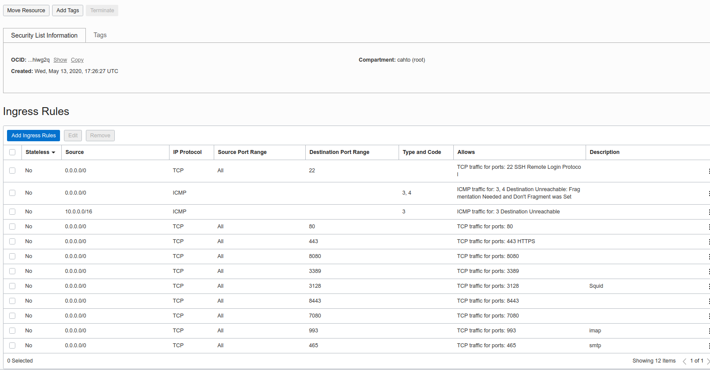

## Oracle Cloud - Free Tier
 
## Tutorial

- https://developer.oracle.com/oracle-cloud-infrastructure/compute-vm-simple-tutorial/
- https://docs.oracle.com/pt-br/iaas/developer-tutorials/tutorials/wp-on-ubuntu/01-summary.htm#install-wordpress-ubuntu
- https://docs.oracle.com/pt-br/iaas/Content/Compute/References/bestpracticescompute.htm#Best_Practices_for_Your_Compute_Instance

https://www.digitalocean.com/community/tutorials/how-to-set-up-a-firewall-using-firewalld-on-centos-8-pt


## Estudar:

https://docs.oracle.com/pt-br/iaas/Content/API/Concepts/cloudshellintro.htm


para testar usar o php php -S 0.0.0.0:80 -t /tmp


## Portas




## OCI

### Deletar um volume

```sh

# listar dominios
oci iam availability-domain list

# oci bv boot-volume list -c <compartimentID> --availability-domain <>
oci bv boot-volume list -c ocid1.tenancy.oc1..aaaaaaaaizlsuez6vlyop2xlhymzxadp4cbqpcwlsnf2buzsvpgmf47gntia --availability-domain olcZ:US-ASHBURN-AD-3


```